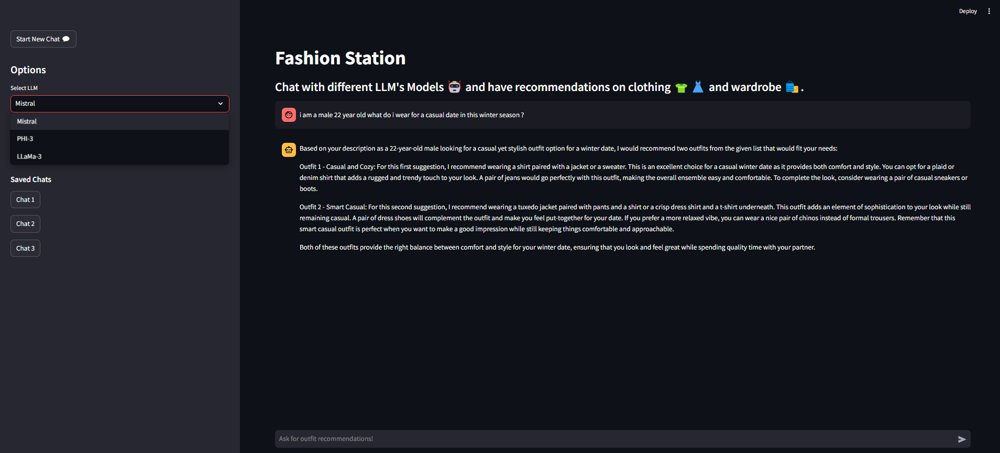

# Fashion Station: Chatbot for Outfit Recommendations



Fashion Station is an interactive chat application built using Streamlit, providing users with personalized outfit recommendations based on their inputs. The app uses a variety of LLMs (Language Learning Models) to provide context-aware suggestions, with a user-friendly interface for interacting with the chatbot.
## Features

- **Outfit Recommendations**: Based on user prompts, the app provides tailored outfit suggestions from a predefined list of clothing items.
- **Chat Management**: Users can start new chats and select from different pre-trained language models (LLMs) to interact with.
- **Model Selection**: Users can choose from multiple LLMs such as Mistral, PHI-3, and LLaMa-3.
- **Chat History**: The app allows users to view and select from previously saved chat sessions.
- **Error Logging**: The app logs errors to a file (`app.log`), ensuring better traceability of issues during execution.

## Installation

### Prerequisites

- Python 3.7 or later
- Streamlit
- langchain-Ollama

### Setup

1. **Clone the repository:**

   ```bash
   git clone https://github.com/raunakgola/Fation.git
   cd Fation
   ```

2. **Create a virtual environment:**

   ```bash
   python -m venv venv
   ```

3. **Activate the virtual environment:**

   - On Windows:
     ```bash
     .\venv\Scripts\activate
     ```
   - On macOS/Linux:
     ```bash
     source venv/bin/activate
     ```

4. **Install the required packages:**

   ```bash
   pip install -r requirements.txt
   ```

5. **Run the application:**

   ```bash
   streamlit run app.py
   ```

## Usage

1. Open your web browser and navigate to `http://localhost:8501`.
2. Select a model from the sidebar (`Llama3`, `Phi3`, `Mistral`).
3. Enter your question in the chat input box and press Enter.
4. View the model's response in real-time.

## Code Overview

- **Initialization**: Sets up logging and initializes chat history in session state.
- **Model Selection**: Users can select from Llama3, Phi3, and Mistral models.
- **Chat Input**: Captures user input and appends it to the session state.
- **Streaming Responses**: Uses the Ollama LLM to generate responses and streams them back to the user.
- **Error Handling**: Logs errors and displays them in the UI if they occur.

## How the App Works

Here's an example of how the app works:

1. Model Initialization: The app initializes the selected language model using Langchain's OllamaLLM based on the user's choice from the sidebar.
2. User Interaction: Users can type their clothing-related prompts in the chat input. For example, "What should I wear to a wedding?" The system processes the input, generates outfit recommendations, and returns them in a structured format.
3. Outfit Suggestions: The app responds with a pair of outfit suggestions from a predefined list, considering the context provided in the user's prompt. The suggestions include detailed information, like matching accessories or seasonal recommendations.
4. Error Logging: Any errors encountered during the initialization or processing of responses are logged into app.log for troubleshooting.
## Contributing

Contributions are welcome! Please open an issue or submit a pull request.

## License

This project is open-sourced. 

## File Structure
fashion_station/

├── app.py               # Main Streamlit app script

├── app.log              # Log file to capture errors and other logs (created while running app)

├── responses.txt       # File to store chat history  (created while running app)

├── requirements.txt     # List of Python dependencies

└── README.md            # This file


## Acknowledgements

This project uses the following libraries:
- [Streamlit](https://streamlit.io/)
- [Ollama](https://python.langchain.com/docs/integrations/llms/ollama/)

Feel free to reach out if you have any questions or need further assistance. Happy coding!
